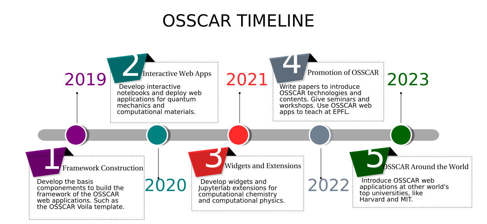

#######
Roadmap
#######

Goals 
-------

In the OSSCAR (Open Software Services for Classrooms and Research) project, we
developed tools and materials for computational chemistry and computational
physics research and education. Within the project we focus on 4 main objectives:

1. Developing advanced custom visualizations as web applications for education.
2. Creating custom Jupyter widgets for computational chemistry and computational physics.
3. Authoring JupyterLab extensions and tools for research and development.
4. Offering documents and tutorials to developers who wish to use OSSCAR technologies.

How you can contribute to OSSCAR
--------------------------------

Contributions to the project are most welcome and could take different forms. If you have an idea in mind for a new notebook that would fit into one of the existing domains covered in OSSCAR (the various sections that can be found at https://github.com/osscar-org/quantum-mechanics), check out the `"How to contribute" <../code/contributing.html>`_ page for more information.

Future plans for the project
----------------------------

The path envisioned for advancing the OSSCAR project consists of a joint bottom-up and top-down approach.
In the near-term future, we intend to host several workshops/tutorials. These shall have the goal of introducing interested members of the community to OSSCAR and its associated technologies, along with providing instruction on how to develop new lessons and tools for use in classroom environments.

We hope to further expand the portfolio of core notebooks available at https://github.com/osscar-org/quantum-mechanics. Work on various new notebooks within the domains of quantum mechanics, band theory, statistical mechanics, etc., is already underway in-house and is primarily guided by the needs of various classes taught at EPFL. However, as discussed in on the `"How to contribute page" <../code/contributing.html>`_, any contributions to this collection are more than welcome.

Another feature that we intend to eventually integrate into the OSSCAR ecosystem is that of a registry of applications. These may either directly make use of OSSCAR technologies, or themselves also constitute e-learning content analogous to that found in https://github.com/osscar-org/quantum-mechanics, and which may benefit from the visibility of being advertised within the project. In such a way, our ambition is to evolve into a hub for educational resources that may be shared openly.
   
Timeline
---------

The OSSCAR project started in October, 2019. During the 1st year (2019-2020), our 
focus was primarily on the development of components for the OSSCAR web
applications framework. We experimented with several different tools such as appmode_ for
rendering the notebooks and Jmol_ for the molecular visualizations. We
opted to leverage the Voila_ Jupyter extension to render the interactive notebooks as web apps. We subsequently developed an OSSCAR style template (`voila-osscar-template`_) for the Voila web
apps. 

In the 2nd year (2020-2021), we began developing interactive notebooks
for computational chemistry and computational physics education. We developed
several interactive notebooks for quantum mechanics education. At the time, we were using the
free cloud server `mybinder.org`_ to deliver the notebooks as web apps. The
proof-of-concept web apps proved to work well. However, we found that there was
a major drawback using the mybinder server, with the loading process proving to be very
slow. We were also starting to develop custom Jupyter widgets for computational
chemistry and computational physics, like the `widget-periodictable`_ (an
interactive periodic table as Jupyter widget).

In the 3rd year (2021-2022), we have developed several custom Jupyter widgets
for computational chemistry and physics, like `widget-bzvisualizer`_ (a Jupyter
widget to visualize the 1st Brillouin zone and band path), `widget-bandsplot`_
(a widget to plot bandstructure and density of states), `widget-code-input`_ (a
widget to allow users to define interactive Python functions). We created a
collection of interactive and educational web apps for quantum mechanics and
computational materials science, which contains sections such as "quantum
mechanics", "band theory", "statistical mechanics" and "molecular dynamics". We
set up two dokku_ servers under the Materials Cloud project using the Swiss
supercomputing infrastructure at CSCS_. Our web apps have since been successfully deployed on dokku
servers with lower latency.

In the 4th year (2022-2023), we are planning to make more high quality
interactive web apps and introduce new technologies to support them. We are
going to present and promote the OSSCAR project in conferences and workshops. Moreover, we
will encourage more instructors and students, both from EPFL and outside, to contribute and use
OSSCAR web apps and technologies, with the hope that they shall provide a powerful educational tool in classrooms across a host of academic institutions.

News
----------
* **2023 11.05**: OSSCAR project was presented at `JupyterCon 2023`_ by Taylor Baird.
* **2023.01.01**: 1st OSSCAR paper `"OSSCAR, an open platform for collaborative development of computational tools for education in science"`_ published on Computer Physics Communications.
* **2022.03.09**: `CECAM workshop`_: Presenting an OSSCAR…collaborative platform for Open Software Services for Classroom and Research.
* **2021.07.09**: OSSCAR project was presented by Dr. Dou Du in `"2021 AiiDA tutorial week - virtual edition"`_ workshop. 
* **2021.03**: OSSCAR web applications for quantum mechanics and computational materials science were introduced to EPFL classroom by Dr. Giovanni Pizzi in the `"atomisitc and quantum simulations of materials"`_ course.
* **2021.01.11**: Dr. Giovanni Pizzi and Dr. Dou Du were awarded the `Digital Resources for Instruction and Learning fund`_.
* **2020.07.10**: OSSCAR project was presented for the 1st time by Dr. Dou Du in `"2022 AiiDA tutorial week - virtual edition"`_ workshop.
  

.. _"2022 AiiDA tutorial week - virtual edition": https://aiida-tutorials.readthedocs.io/en/tutorial-2020-intro-week
.. _Digital Resources for Instruction and Learning fund: https://www.epfl.ch/education/educational-initiatives/cede/digitaltools/dril
.. _"atomisitc and quantum simulations of materials": https://moodlearchive.epfl.ch/2020-2021/enrol/index.php?id=15202
.. _"2021 AiiDA tutorial week - virtual edition": https://aiida-tutorials.readthedocs.io/en/tutorial-2021-intro
.. _appmode: https://github.com/oschuett/appmode
.. _Jmol: http://jmol.sourceforge.net
.. _Voila: https://github.com/voila-dashboards/voila
.. _voila-osscar-template: https://github.com/osscar-org/voila-osscar-template
.. _mybinder.org: https://mybinder.org
.. _widget-periodictable: https://github.com/osscar-org/widget-periodictable
.. _widget-bzvisualizer: https://github.com/osscar-org/widget-bzvisualizer
.. _widget-bandsplot: https://github.com/osscar-org/widget-bandsplot
.. _widget-code-input: https://github.com/osscar-org/widget-code-input
.. _dokku: https://dokku.com
.. _CSCS: https://www.cscs.ch
.. _CECAM workshop: https://www.cecam.org/workshop-details/1166
.. _paper: https://doi.org/10.1016/j.cpc.2022.108546
.. _"OSSCAR, an open platform for collaborative development of computational tools for education in science": https://doi.org/10.1016/j.cpc.2022.108546
.. _JupyterCon 2023: https://www.jupytercon.com/

