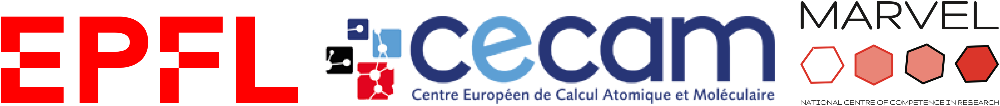

########
Homepage
########

The OSSCAR (Open Software Services for Classrooms and Research) platform is a collaborative environment targeted at enhancing awareness and adoption of best practises in Open Science and computational thinking, focusing on education and research. 

OSSCAR develops original educational content such as the pedagogical web application demonstrated in the animation below. This content is offered by exploiting the
infrastructural resources developed for `Materials Cloud <https://www.materialscloud.org>`_, and disseminated
widely through the `CECAM`_ network and beyond. 

|

.. image:: images/osscar-demo.gif
  :width: 600
  :alt: osscar demo
  :align: center
	  
|

.. grid:: 1 2 2 2
   :gutter: 3

   .. grid-item-card:: :fa:`book;mr-1` **Course Applications**
      :text-align: center
      :shadow: md

      Browse OSSCAR-developed applications for courses in quantum mechanics and
      computational materials science.

      +++++++++++++++++++++++++++++++++++++++++++++

      .. button-ref:: courses/index
         :ref-type: doc
         :click-parent:
         :expand:
         :color: primary
         :outline:
         
         To the course applications

   .. grid-item-card:: :fa:`file-code;mr-1` **OSSCAR tools**
      :text-align: center
      :shadow: md

      How to develop interactive web applications with Jupyter notebooks
      using OSSCAR technologies and a collection of widgets and 
      extensions for use in the applications.

      +++++++++++++++++++++++++++++++++++++++++++++

       .. button-ref:: courses/index
          :ref-type: doc
          :click-parent:
          :expand:
          :color: primary
          :outline:

          To the tutorial

   .. grid-item-card:: :fa:`fa-github;mr-1` **OSSCAR code**
      :text-align: center
      :shadow: md

      Check out all (open-source!) code developed by OSSCAR (courses, widgets, ...) and learn how to contribute to the project.

      +++++++++++++++++++++++++++++++++++++++++++++

      .. button-ref:: courses/index
         :ref-type: doc
         :click-parent:
         :expand:
         :color: primary
         :outline:

         To OSSCAR source and contribution guide

   .. grid-item-card:: :fa:`users;mr-1` **About OSSCAR**
      :text-align: center
      :shadow: md

      Information about the OSSCAR project.

      +++++++++++++++++++++++++++++++++++++++++++++

      .. button-ref:: courses/index
         :ref-type: doc
         :click-parent:
         :expand:
         :color: primary
         :outline:

         To about section

Acknowledgements
*****************

OSSCAR is a project funded by the 
`EPFL Open Science Fund <https://www.epfl.ch/research/open-science/in-practice/open-science-fund>`_ 
and is developed in collaboration between 
`CECAM <https://www.cecam.org>`_ and 
`NCCR MARVEL <https://nccr-marvel.ch>`_.

How to cite 
************

If you use OSSCAR notebooks or technology, we would appreciate if you could cite the following paper:

| D. Du, T. Baird, S. Bonella and G. Pizzi, OSSCAR, an open platform for collaborative development of computational tools for education in science, 
  *Computer Physics Communications*, **282**, 108546 (2023).
| `https://doi.org/10.1016/j.cpc.2022.108546 <https://doi.org/10.1016/j.cpc.2022.108546>`_

